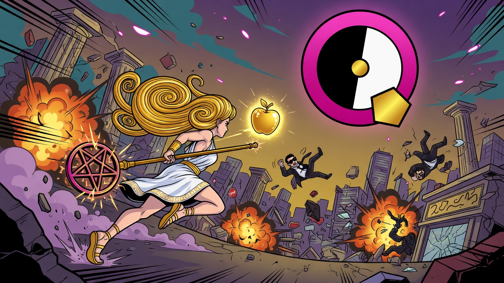
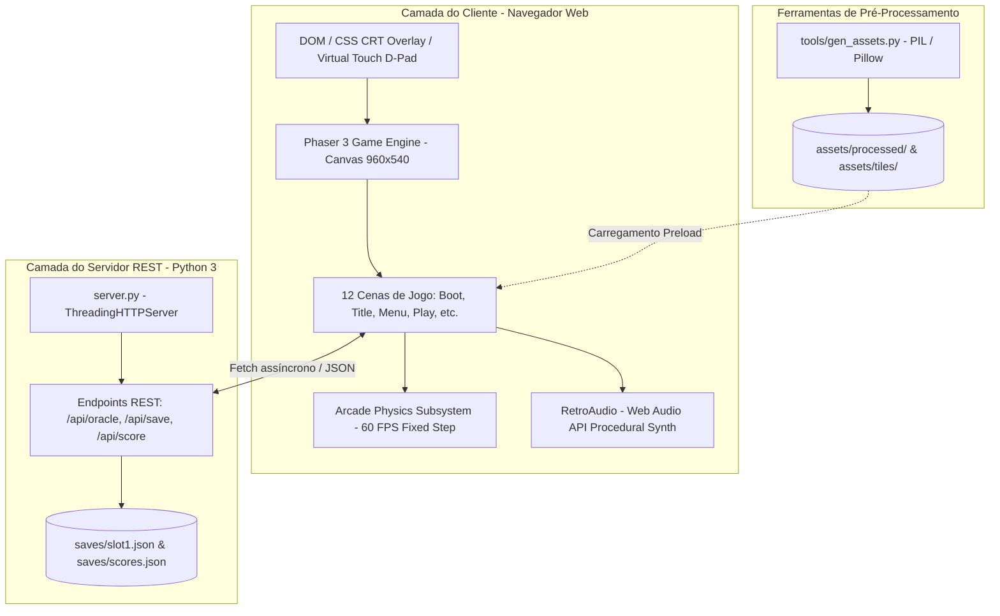

<div align="center">



# 🍎 ERIS SLUG: PRINCIPIA DISCORDIA 🌀

**Retro Run-and-Gun 2D Engine | Phaser 3 (WebGL/Canvas) · Web Audio Procedural · Backend REST Python**

[](https://phaser.io/)
[](https://python.org/)
[-FF6F00?style=for-the-badge)](https://developer.mozilla.org/en-US/docs/Web/API/Web_Audio_API)
[-4CAF50?style=for-the-badge)](https://photonstorm.github.io/phaser3-docs/)
[](https://github.com)
[](LICENSE)

*Um clone técnico-estrutural de Metal Slug 5 ambientado na mitologia contracultural do Discordianismo (Principia Discordia, Lei dos Cincos, Sagrado Chao e a guerra contra Greyface).*

</div>

---

## 📑 Índice

- [1. Visão Geral do Projeto](#-1-visão-geral-do-projeto)
- [2. Especificações Técnicas (Tech Specs)](#-2-especificações-técnicas-tech-specs)
- [3. Arquitetura do Sistema](#-3-arquitetura-do-sistema)
- [4. Estrutura do Repositório](#-4-estrutura-do-repositório)
- [5. Engenharia do Game Engine](#-5-engenharia-do-game-engine)
  - [5.1 Máquina de Estados de Cenas (Scene Lifecycle)](#51-máquina-de-estados-de-cenas-scene-lifecycle)
  - [5.2 Loop Central de Física e Entidades](#52-loop-central-de-física-e-entidades)
  - [5.3 Sistema de Armas e Balística](#53-sistema-de-armas-e-balística)
  - [5.4 Mecânica de Veículo (Apple Slug)](#54-mecânica-de-veículo-apple-slug)
  - [5.5 Inteligência Artificial dos Inimigos](#55-inteligência-artificial-dos-inimigos)
  - [5.6 Geração Procedural Determinística (`hash23`)](#56-geração-procedural-determinística-hash23)
  - [5.7 Batalhas contra Chefes em Múltiplas Fases](#57-batalhas-contra-chefes-em-múltiplas-fases)
- [6. Subsistema de Áudio Sintetizado (Zero Assets de Som)](#-6-subsistema-de-áudio-sintetizado-zero-assets-de-som)
- [7. Pipeline de Pré-Processamento de Assets](#-7-pipeline-de-pré-processamento-de-assets)
- [8. API REST e Persistência de Dados](#-8-api-rest-e-persistência-de-dados)
- [9. Setup, Execução Local e Deploy](#-9-setup-execução-local-e-deploy)
- [10. Padrões Git e Diretrizes de Contribuição](#-10-padrões-git-e-diretrizes-de-contribuição)
- [11. Lore Discordiano e Filosofia de Design](#-11-lore-discordiano-e-filosofia-de-design)
- [12. Licença](#-12-licença)

---

## 🌟 1. Visão Geral do Projeto

**ERIS SLUG: PRINCIPIA DISCORDIA** é um run-and-gun retro desenvolvido em JavaScript moderno com o framework **Phaser 3** no cliente e um micro-servidor REST em **Python 3** no backend.

O projeto reproduz a densidade de ação, cadência de tiro em 8 direções, pulo, esquiva, combate corpo a corpo (melee contextual), arremesso balístico de granadas, destruição de caixas POW, resgate de reféns (Papas Discordianos) e blindados pilotáveis (*Apple Slug*) inspirados nos clássicos da franquia *Metal Slug* (notadamente *Metal Slug 5*), integrados conceitualmente à mitologia da deusa greco-discordiana **Eris**.

### 💡 Destaques de Engenharia
- **Zero Dependências Externas de Áudio**: Efeitos sonoros e trilhas sonoras sintetizados via **Web Audio API** procedural em tempo real (0 bytes de áudio baixados pela rede).
- **Zero Dependências de Terceiros no Backend**: Servidor HTTP assíncrono multithread nativo usando apenas a biblioteca padrão do Python (`http.server.ThreadingHTTPServer`).
- **Pipeline de Assets Automatizado**: Script em Python/Pillow com algoritmos de chroma-key, remoção de fundo espectral e normalização de bounding boxes de sprites.
- **Limites de Entidades Estritos (Resource Pooling & Caps)**: Caps rígidos para projéteis (`BULLET_CAP = 40`), projéteis inimigos (`EBU_CAP = 30`) e efeitos visuais (`FX_CAP = 22`), assegurando 60 FPS estáveis mesmo em dispositivos com hardware reduzido.
- **Suporte Híbrido Desktop & Mobile**: Controles via teclado/mouse e overlay virtual D-Pad touch responsivo com `preventDefault`.

---

## ⚙️ 2. Especificações Técnicas (Tech Specs)

| Parâmetro | Detalhe Técnico |
|---|---|
| **Resolução Nativa** | 960 × 540 pixels (Escala dinâmica `Phaser.Scale.FIT`, centralização automática) |
| **Pipeline Gráfico** | WebGL 2.0 com fallback para Canvas 2D (`powerPreference: 'high-performance'`) |
| **Motor de Física** | Phaser Arcade Physics (Gravidade: `Y = 1280 px/s²`, `fixedStep: true`, 60 Hz) |
| **Arquitetura de Áudio** | Síntese por osciladores (`OscillatorNode`), buffers de ruído e filtros biquad |
| **Backend REST** | Python 3 `ThreadingHTTPServer`, serialização JSON pura, suporte a CORS |
| **Camada de Shaders** | Overlay CSS de filtro CRT (Scanlines + curvatura de tubo + aberração cromática) |
| **Deploy em Produção** | Compatível com Firebase Hosting (SPA estática) ou Container Docker/Cloud Run |

---

## 📐 3. Arquitetura do Sistema

O sistema é dividido em quatro camadas bem delimitadas:



---

## 📁 4. Estrutura do Repositório

```text
ERIS_SLUG/
├── capa.jpg                # Foto de capa / banner principal do repositório (1280x720)
├── index.html              # Ponto de entrada web, DOM, touch controls e tags AdSense
├── styles.css              # Estilização retro-arcade, HUD e overlay CRT scanline
├── run_game.py             # Launcher executável: aloca porta livre e abre o navegador
├── server.py               # Servidor RESTful HTTP multithread nativo em Python
├── firebase.json           # Configuração de deploy no Firebase Hosting (Cache + CORS)
├── .firebaserc             # Definição do projeto Firebase CLI
├── .gitignore              # Ignora saves locais, caches __pycache__ e *.pyc
│
├── js/                     # Código-fonte JavaScript modular do motor
│   ├── config.js           # Matrizes de armas, inimigos, chefes, missões e aforismos
│   ├── audio.js            # RetroAudio: motor de síntese procedural via Web Audio API
│   ├── boot.js             # BootScene: gerenciamento de assets, atlas e animações
│   ├── menus.js            # Cenas de navegação: Title, Menu, MissionSelect, Options, etc.
│   ├── play.js             # PlayScene: motor principal de combate, física e entidades
│   ├── main.js             # Instanciação do Phaser.Game e configuração do ciclo de vida
│   └── ad-config.js        # Configuração modular e disparos de slots publicitários
│
├── assets/                 # Recursos gráficos pré-processados e organizados
│   ├── characters/         # Spritesheets originais de personagens
│   ├── processed/          # Sprites recortados, alinhados com fundo transparente
│   ├── backgrounds/        # Fundos de céu por missão e estação do ano
│   ├── env/                # Camadas de ambiente e parallax
│   ├── tiles/              # Tilesets de solo e plataformas sólidas
│   ├── items/              # Colecionáveis, caixas de munição, alimentos sagrados
│   ├── vehicles/           # Sprites do tanque Apple Slug e canhão
│   ├── fx/                 # Efeitos de explosão, fumaça e faíscas
│   └── vendor/             # Distribuição local minificada do Phaser 3
│
├── tools/                  # Ferramentas de desenvolvimento e pipelines de dados
│   └── gen_assets.py       # Script PIL para extração de sprites, chroma-key e padding
│
└── saves/                  # Persistência local gerenciada pelo servidor (ignorado no Git)
    ├── slot1.json          # Savegame do jogador (progresso, vidas, score, missão)
    └── scores.json         # Tabela de recordes locais (Top 23 Discordiano)
```

---

## 🕹️ 5. Engenharia do Game Engine

### 5.1 Máquina de Estados de Cenas (Scene Lifecycle)

O jogo implementa um grafo desacoplado de 12 cenas orquestradas pelo `SceneManager` do Phaser:

```
[BootScene] ──> [TitleScene] ──> [MenuScene]
                                     ├──> [MissionSelect] ──┐
                                     ├──> [OptionsScene]    │
                                     ├──> [CreditsScene]    │
                                     └──> [BriefingScene] <─┘
                                                │
                                                ▼
                                          [PlayScene] <───────────────────┐
                                          ├── Boss Derrotado ─> [Complete] ─┤ (Próxima)
                                          ├── Morte (Tem vidas) ─> Respawn  │
                                          └── Game Over ─> [ContinueScene] ─┘
                                                                 ├── Sim ─> Reinicia
                                                                 └── Não ─> [GameOver]
                                                                                │
                                                                                ▼
                                                                        [EndingScene]
```

### 5.2 Loop Central de Física e Entidades

Em [`js/play.js`](js/play.js), cada tick do `update(time, delta)` gerencia subsistemas determinísticos:

1. **Leitura e Priorização de Input**: Combinação de gamepad, teclas digitais e touch screen.
2. **Cálculo Cinemático do Jogador**: Suporte a aceleração no solo, arrasto no ar e pulo variável baseado no tempo de sustentação da tecla.
3. **8-Way Aiming & Melee Proximity Check**: Se um inimigo estiver a menos de 48px de distância, o disparo padrão é substituído automaticamente por um corte de adaga melee de dano alto sem consumo de munição.
4. **Resolução de Colisão Balística**: Detecção de impacto de projéteis contra camadas de solo (`groundGroup`), plataformas one-way (`platGroup`) e caixas/barris destrutíveis.
5. **Entity Cap Enforcer**:
   ```javascript
   const FX_CAP = 22;       // Limite simultâneo de explosões e partículas
   const BULLET_CAP = 40;   // Limite de balas ativas do jogador
   const EBU_CAP = 30;      // Limite de balas ativas dos inimigos
   ```

### 5.3 Sistema de Armas e Balística

Configurado em [`js/config.js`](js/config.js), o sistema implementa balanceamento paramétrico:

| ID | Nome Discordiano | Dano | Cadência (ms) | Munição | Velocidade | Espalhamento | Características Balísticas |
|---|---|---|---|---|---|---|---|
| `pistol` | **Maçã de Bolso** | 12 | 150 | ∞ | 560 | ±2° | Disparo contínuo padrão, projétil leve |
| `hmg` | **HMG Pentabarfo** | 8 | 50 | 200 | 640 | ±6° | Alta cadência, ricochete acústico |
| `shot` | **Espingarda Kallisti** | 10 × 5 | 360 | 32 | 500 | ±16° | 5 projéteis por disparo, spread amplo, alto impacto a curta distância |
| `rocket` | **Foguete do Chao** | 78 | 460 | 22 | 400 | 0° | Aceleração linear com raio de explosão (86px) em área |
| `flame` | **Sopro Pineal** | 6 | 40 | 90 | 260 | ±10° | Projéteis persistentes com colisão contínua |
| `laser` | **Raio da Discórdia** | 15 | 70 | 220 | 920 | 0° | Alta velocidade e penetração (`pierce: 4`) em múltiplos inimigos |
| `chaser` | **Perseguidor Fnord** | 34 | 300 | 18 | 280 | 0° | Trajetória guiada (`homing: true`) por algoritmo de busca angular |
| `lizard` | **Lagarto de Ferro** | 42 | 380 | 16 | 240 | 0° | Rasteja pelo contorno do terreno até impactar |
| `drop` | **Drop Shot** | 58 | 340 | 18 | 90 | 0° | Balística parabólica que quica no chão antes de detonar |

### 5.4 Mecânica de Veículo (Apple Slug)

Inspirado no clássico tanque *Metal Slug*:
- **Montagem**: O jogador assume o controle pressionando `↓` ao colidir com o veículo. O sprite do jogador é ocultado e a caixa de colisão física muda para a geometria do blindado.
- **Armamento Duplo**: Canhão de maçãs explosivas pesado + metralhadoras rotativas Vulcan independentes que rastreiam o ângulo de mira.
- **Proteção e Ejeção**: O veículo possui barra de blindagem própria; ao ser destruído ou ao pressionar `↓ + Pulo`, o jogador é ejetado para o ar com frames de invulnerabilidade (i-frames).

### 5.5 Inteligência Artificial dos Inimigos

Os inimigos são regidos por 8 arquétipos comportamentais:
- `walker` (MIB, Viper, Masson): Patrulha o terreno com raycast de borda; para e dispara ao entrar no cone de visão.
- `jumper` (Ninja): Alterna corridas rápidas com saltos parabólicos sobre o jogador.
- `flyer` (Alien, TV-Man, Dark Spirit, Cthulhu): Vôo senoidal/ondulatório com perseguição do eixo X da heroína.
- `tank` (Robot, Gollen): Unidades blindadas de alto HP que disparam múltiplos projéteis pesados.
- `teleport` (Freddy): Desaparece em fumaça após sofrer dano e ressurge em posições adjacentes.
- `brute` (Jason): Move-se em direção implacável ao alvo, arremessando pedregulhos e causando dano por contato.
- `grenadier` (McJoker): Mantém distância média e calcula arremessos em arco de granadas explosivas.
- `turret` (Torreta): Montagem estacionária em plataformas elevadas com disparo cadenciado em 360°.

### 5.6 Geração Procedural Determinística (`hash23`)

Para garantir que o design das 5 missões (que chegam a ultrapassar 12.000 pixels de largura cada) seja rico em variações, mas ao mesmo tempo 100% reproduzível entre sessões sem a necessidade de armazenar mapas gigantescos em disco, o motor emprega o gerador pseudo-aleatório baseado no **número 23**:

```javascript
function hash23(n) {
  n = (n ^ 23) >>> 0;
  n = Math.imul(n ^ (n >>> 16), 2246822507);
  n = Math.imul(n ^ (n >>> 13), 3266489909);
  return ((n ^ (n >>> 16)) >>> 0) / 4294967296;
}
```

Este algoritmo distribui de maneira determinística os pontos de spawn de infantaria, posições de plataformas flutuantes, prisioneiros a serem resgatados, caixas de munição e barris inflamáveis.

### 5.7 Batalhas contra Chefes em Múltiplas Fases

| Missão | Codinome | Título do Chefe | Pontos de Vida (HP) | Comportamento e Fases |
|---|---|---|---|---|
| **M1** | WINDY DISCORDIA | **Gollen** (Golias de Pedra) | 900 HP | Arremesso de blocos, ondas de choque sísmicas no chão e esmagamento |
| **M2** | HEAVY CONFUSION | **TV-Man** (Fortaleza de Sinais) | 860 HP | Feixes de interferência, emissão de orbes estáticos e voo veloz |
| **M3** | THE WALL OF GREYFACE | **Cyber-01** (Broca da Burocracia) | 940 HP | Ataques de perfuração na arena, disparos laser e blindagem frontal |
| **M4** | SAND MARINE OF CHAO | **Cthulhu** (Lulas do Abismo) | 1100 HP | Tentáculos subterrâneos, bolhas tóxicas e rajadas de orbes |
| **M5** | LAST DITCH OF ERIS | **Dark Spirit** (Rei do Dogma) | 1300 HP | Teletransporte multidirecional, chuva de meteoros e modo berserk |

---

## 🔊 6. Subsistema de Áudio Sintetizado (Zero Assets de Som)

Implementado inteiramente em [`js/audio.js`](js/audio.js), a classe singleton `RetroAudio` elimina a necessidade de transferir arquivos `.wav` ou `.mp3`:

```javascript
// Exemplo: Síntese da explosão procedural em RetroAudio
function boom() {
  noise(0.35, 0.4, 300); // Buffer de ruído branco com filtro bandpass a 300Hz
  const o = osc('sine', 90, 0.4, 0.28); // Onda senoidal com queda exponencial de pitch
  if (o) o.frequency.exponentialRampToValueAtTime(28, ctx.currentTime + 0.4);
}
```

- **Mecanismo de Desbloqueio**: Ativação transparente do `AudioContext` após a primeira interação do usuário (respeitando as políticas de autoplay dos navegadores modernos).
- **Geradores de Envelope ADSR**: Rampas exponenciais que modelam transientes realistas para disparos, impactos e pulos.
- **Composições Chiptune em Tempo Real**: Músicas de fundo tocadas por um sequenciador tracker leve com matriz de notas e arpeggios polifônicos.

---

## 🎨 7. Pipeline de Pré-Processamento de Assets

O utilitário [`tools/gen_assets.py`](tools/gen_assets.py) automatiza a ingestão e preparação dos elementos visuais utilizando **Python Pillow (PIL)**:

1. **Remoção Inteligente de Fundo (Chroma-Keying)**:
   - `chroma_green()`: Segmentação por diferença de canais (`G > R + 35` e `G > B + 20`).
   - `chroma_sheet()`: Remoção de fundos azuis-claros e cinzas de folhas de sprites de personagens.
2. **Auto-Cropping e Normalização**:
   - `trim_and_pad()`: Identifica o bounding box exato do sprite visível, calcula a escala mantendo a proporção original e centraliza a figura em uma tela padronizada de 256×256 pixels com alinhamento pelo rodapé (evitando descolamento do chão nas animações).
3. **Baking de Texturas Procedurais**:
   - Gera texturas de tilesets, granadas, alimentos sagrados, ícones de HUD e atlas de explosão através de primitivas vetoriais rasterizadas.

---

## 🌐 8. API REST e Persistência de Dados

O arquivo [`server.py`](server.py) implementa uma interface RESTful leve:

```text
  GET /api/health        ──> Healthcheck do servidor (Status 200)
  GET /api/oracle        ──> Retorna um aforismo aleatório da Principia Discordia
  GET /api/load          ──> Carrega o savegame (saves/slot1.json)
 POST /api/save          ──> Salva o estado atual (saves/slot1.json)
  GET /api/leaderboard   ──> Lista os Top 23 maiores recordes (saves/scores.json)
 POST /api/score         ──> Adiciona uma nova pontuação ao ranking
```

### Especificação dos Payloads

#### `GET /api/oracle`
```json
{
  "quote": "A hot dog é o sacramento de sexta-feira.",
  "ref": "Hot Dog Day"
}
```

#### `POST /api/save`
```json
{
  "mission": 3,
  "score": 45200,
  "lives": 3,
  "difficulty": "normal"
}
```

#### `GET /api/leaderboard`
Retorna um array ordenado em ordem decrescente, limitado a **23 entradas** (em honra à Lei dos Cincos):
```json
[
  { "name": "ERIS", "score": 999990 },
  { "name": "MALACLYPSE", "score": 750230 }
]
```

---

## 🚀 9. Setup, Execução Local e Deploy

### Pré-requisitos
- **Python 3.8+** (apenas módulos nativos para o servidor).
- **Pillow** (opcional, necessário apenas se for rodar o pipeline `gen_assets.py`):
  ```bash
  pip install pillow
  ```
- Navegador moderno com suporte a WebGL e Web Audio (Chrome, Firefox, Safari, Edge).

### Execução Rápida (Recomendado)
O script [`run_game.py`](run_game.py) busca automaticamente uma porta TCP livre (a partir de 8000), inicia o servidor em segundo plano e abre a página no navegador padrão:

```bash
python3 run_game.py
```

### Execução Dedicada (Headless Server)
Para rodar exclusivamente o servidor HTTP/REST:

```bash
python3 server.py
# Opcional: especificar porta via variável de ambiente
PORT=9000 python3 server.py
```

### Deploy no Firebase Hosting
O projeto já conta com [`firebase.json`](firebase.json) configurado com cabeçalhos de CORS e cache longo para assets estáticos:

```bash
npm install -g firebase-tools
firebase login
firebase deploy
```

---

## 🤝 10. Padrões Git e Diretrizes de Contribuição

Para manter a consistência e qualidade do repositório, siga as boas práticas abaixo:

### Convenção de Commits (Conventional Commits)
Utilize prefixos semânticos em português ou inglês:
- `feat:` Nova funcionalidade (ex: nova arma, novo arquétipo de inimigo).
- `fix:` Correção de bugs de lógica ou renderização.
- `perf:` Otimizações de desempenho no loop do Phaser ou manipulação de memória.
- `refactor:` Alterações de código sem mudança de comportamento.
- `docs:` Modificações na documentação ou README.
- `chore:` Ajustes em scripts de build, assets ou arquivos de configuração.

*Exemplo:*
```bash
git commit -m "feat(weapons): implementa balistica parabolica para o drop shot"
```

### Estrutura de Branches
- `main`: Branch de produção estável.
- `feature/<nome-da-feature>`: Desenvolvimento de novos recursos.
- `bugfix/<descricao-do-fix>`: Correções pontuais.

### Diretrizes de Código
1. **Zero External Runtime Bloat**: Não adicione bibliotecas pesadas de terceiros para funcionalidades que o browser ou o Phaser já oferecem nativamente.
2. **Cap de Performance**: Sempre respeite os limites de `FX_CAP`, `BULLET_CAP` e `EBU_CAP`. Qualquer novo projétil ou efeito visual deve se autodestruir em caso de saída da câmera (`outOfBoundsKill`) ou estouro de timeout.
3. **Mantenha os Comentários Discordianos**: O humor e a lore contracultural fazem parte da identidade do código.

---

## 📜 11. Lore Discordiano e Filosofia de Design

> *"Não há deusa além de Eris, e Ela é a sua Deusa."*  
> — **Principia Discordia**

- **A Lei dos Cincos**: Tudo ocorre em 5 ou em múltiplos de 5 (5 missões, 5 armas principais, grupos de 5 inimigos).
- **O Sagrado Chao**: Símbolo central unindo Hodge (ordem aparente) e Podge (caos criativo) com o pentágono e a maçã dourada.
- **Greyface**: O arquivilão que convenceu a humanidade de que o universo deve ser sério, cinzento e burocrático. Suas forças (MIB e robôs carimbadores) patrulham a Muralha da Ordem na Missão 3.
- **Kallisti**: A inscrição na maçã dourada que iniciou a lenda — *"Para a Mais Bela"*.

---

## 📄 12. Licença

Este projeto é disponibilizado sob os termos da filosofia **Kallisti / Discordiana**:

```text
HAIL ERIS! KALLISTI!
Toda pessoa neste planeta é um Papa Discordiano licenciado.
Você tem permissão para desfrutar, clonar, modificar, distribuir, subverter
e rir deste código, desde que não imponha a seriedade cinzenta de Greyface.
```

---

<div align="center">
  <b>ERIS SLUG · 23 DISCORDIAN YEAR · CINCO TONELADAS DE LINHO</b>
</div>
